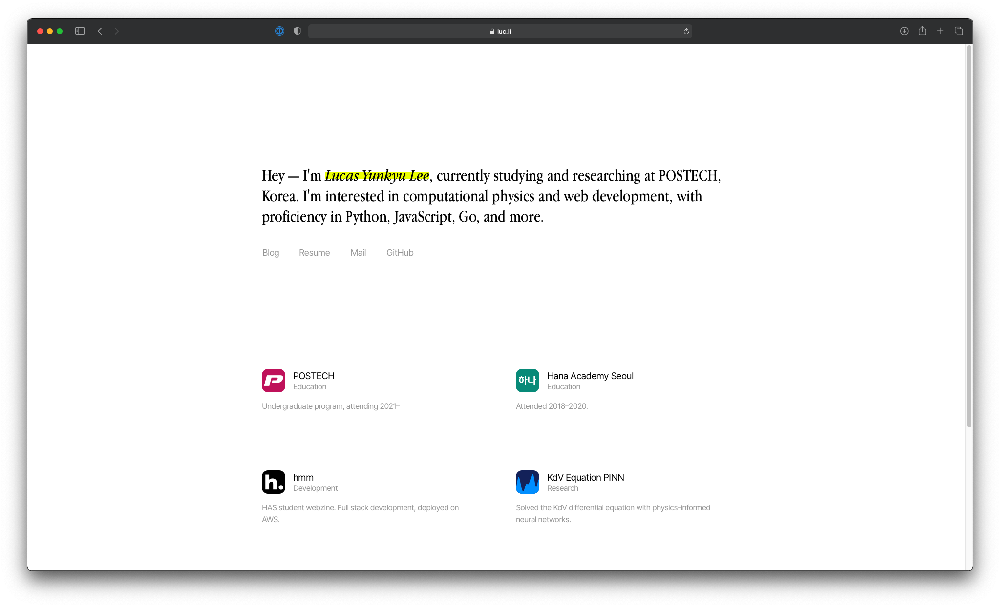

# [luc.li](https://luc.li)

Website of Lucas Yunkyu Lee. Powered by [Gatsby](http://gatsbyjs.com), hand-crafted with ❤️.

---

## Technology Stack

### Frontend

- React with Gatsby SSG in TypeScript
- CSS-in-JS via styled-components

### Backend

- Hosted on AWS S3
- Served by AWS CloudFront
- Headers and redirection by AWS Lambda@Edge

### Tooling

- CI/CD with GitHub Actions
- Formatted and linted automatically via lint-staged
- Formatted with prettier
- Linted with eslint and stylelint
- Type checked with tsc

## Notes

- Developed on macOS (M1 arm64)
- Uses calendar versioning as it is more suitable than semantic versioning for a blog
