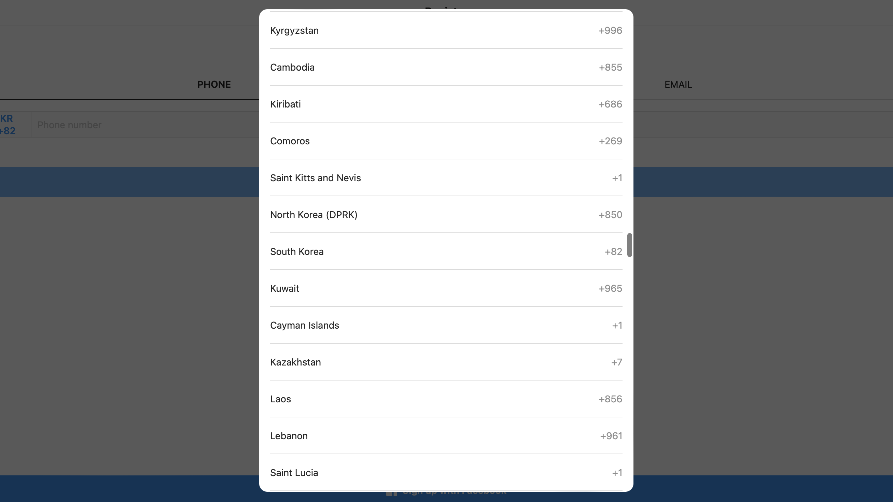

## The problem

I frequently wrestle with region lists when looking for Korea, where I live. To demonstrate what I mean, here's AWS using "Republic of Korea", the official name of Korea:

And here's possibly the worst offender, Instagram (on a mobile useragent) using "South Korea", except located among "K".[^1]

Websites just can't seem to agree upon a format and ordering of country names. So, I end up:

- Looking for "South Korea" in "S"
- Looking for "Republic of Korea" in "R"
- Looking for "Korea", "South Korea", "Republic of Korea", "Korea (South)", "Korea (Republic of)" in "K"

...which gets old pretty quickly.

The problem is twofold:

1. **Everyone calls countries different things**
2. **Everyone sorts countries differently**

Let's try to solve these problems.

## The solution

### Standardized country names

[ISO 3166](https://en.wikipedia.org/wiki/ISO_3166) is a standard used for country names. Looking at [the entry for Korea](https://www.iso.org/obp/ui/#iso:code:3166:KR):

- Short name: `KOREA, REPUBLIC OF`
- Short name lower case: `Korea (the Republic of)`
- Full name: `the Republic of Korea`
- Remark (often stated as): `South Korea`

The ISO standard has 3 names (effectively 4 with the remark), all of which are official. I believe the **ISO 3166 short name lower case** format provides the best option:

1. It is already standardized
2. It prioritizes "Korea", the primary portion of the name
3. It contains the meaning of the official name (Republic of Korea)

The core idea is that the main portion of the name comes first, then the auxiliary portion comes in parantheses. This allows the above points applies to other countries.

### Proper sorting

ISO 3166 short name lower case places the main portion of the country name at the front.
This allows us to simply sort countries alphabetically. "Korea (the Republic of)" will naturally be positioned where "Korea" would be.

## Final words

The UX of region selection is not often discussed, but region lists are used fairly often when signing up for an account, choosing shipping addresses, changing location specific results, etc. Consider using ISO 3166 short name lower case standard for better UX when displaying and sorting countries.

Also please make region lists keyboard accessible!

[^1]: Instagram sorts their list by ISO 3166-2 shortcode, causing a large number of countries to be in completely unexpected positions. (e.g. sorted by `KR` for Korea, `KW` for Kuwait, `KY` for Cayman Islands, `KZ` for Kazakhstan)
