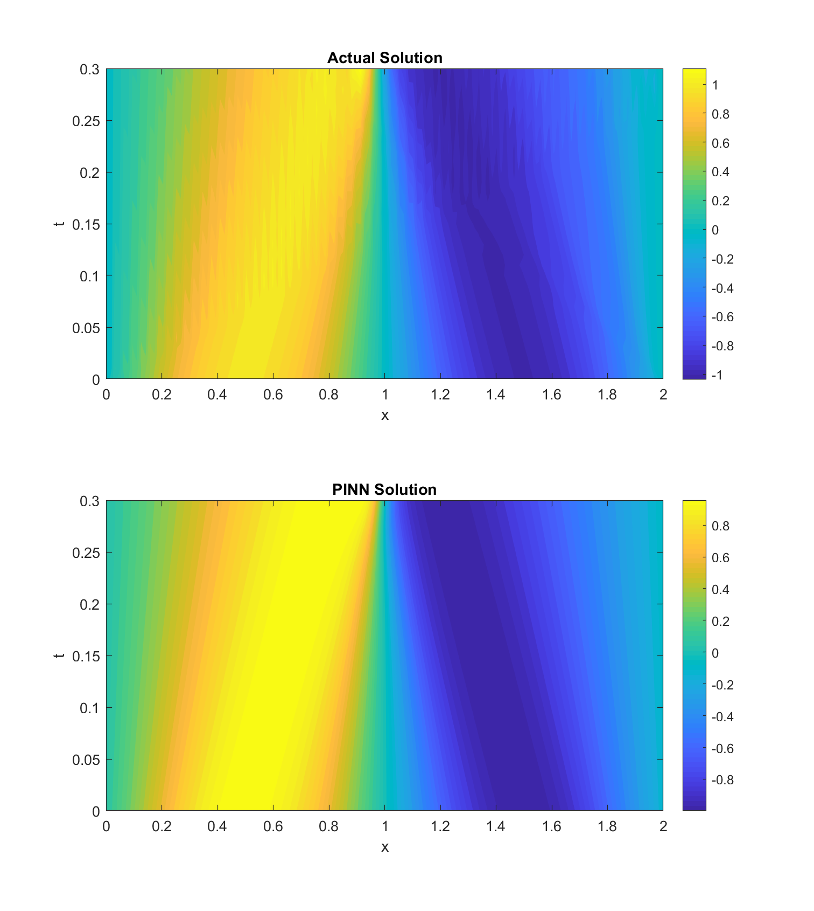

## Introduction

_The following text is a digest from a 2019 study conducted with a co-author._

### The KdV equation

The Korteweg-de Vries (KdV) equation is a model for the behavior of waves on shallow surfaces.
A common form of the equation is as follows:

$$
\partial_t u + \partial_t^3 u - 6 u \ \partial_x u = 0
$$

### Physics-informed neural networks

Physics-informed neural networks (PINNs) are "neural networks that are trained to solve supervised learning tasks while respecting any given laws of physics described by general nonlinear partial differential equations."[^1]
In this study, PINNs were used for the data-driven solution of the KdV equation.

## Obtaining the PINN solution

[DeepXDE](https://github.com/lululxvi/deepxde) and TensorFlow were used for implementation.

### Training data

Training data was obtained by solving the KdV equation numerically in MATLAB.
The Zabusky-Kruskal scheme was used with a specific BC/IC that was then inputed into the PINN.
Among other ICs, solitons of the form $\textrm{sech}^2 \ x$ were examined in detail as soliton solutions are characteristic of the KdV equation.

### Sample solution

[^1]: Raissi, M., Perdikaris, P., & Karniadakis, G. E. (2019). Physics-informed neural networks: A deep learning framework for solving forward and inverse problems involving nonlinear partial differential equations. Journal of Computational Physics, 378, 686-707.
